# 夏日偶像武斗会

[TOC]

## 规则

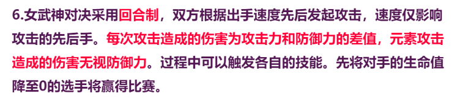

## 选手介绍

### 琪亚娜

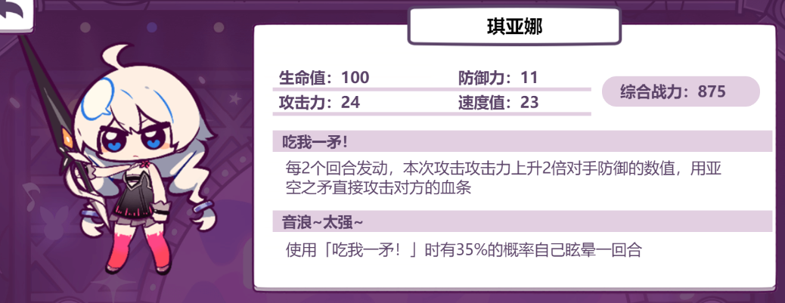

### 芽衣

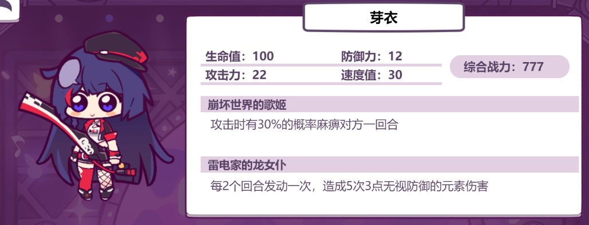

### 布洛妮娅

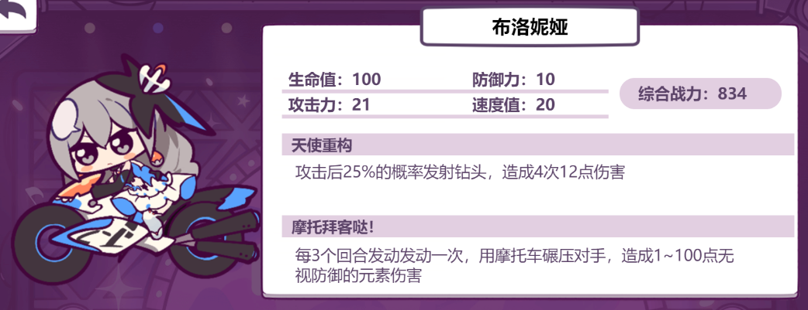

### 姬子

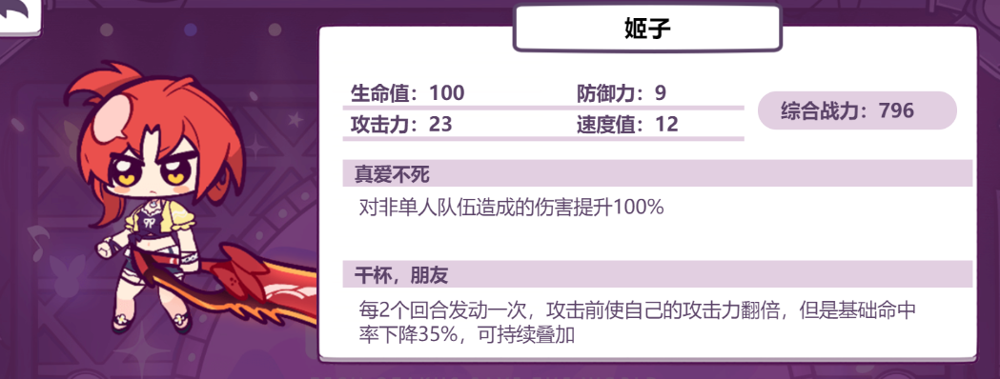

### 丽塔

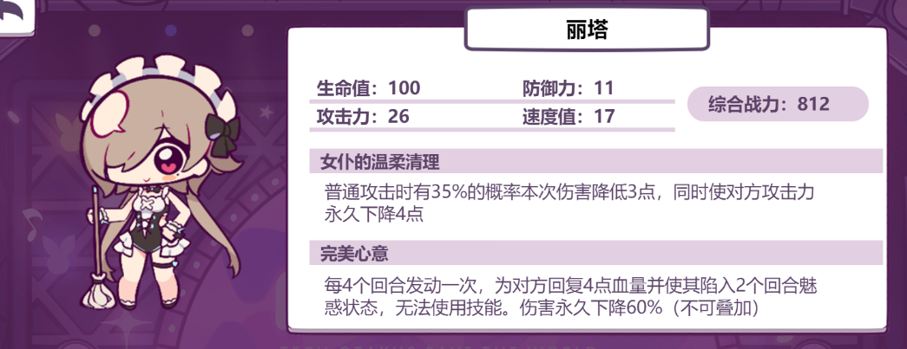

注：“无法使用技能” 后面的句号已改为逗号，即伤害下降 debuff 作用在对方身上。

### 八重樱 & 卡莲

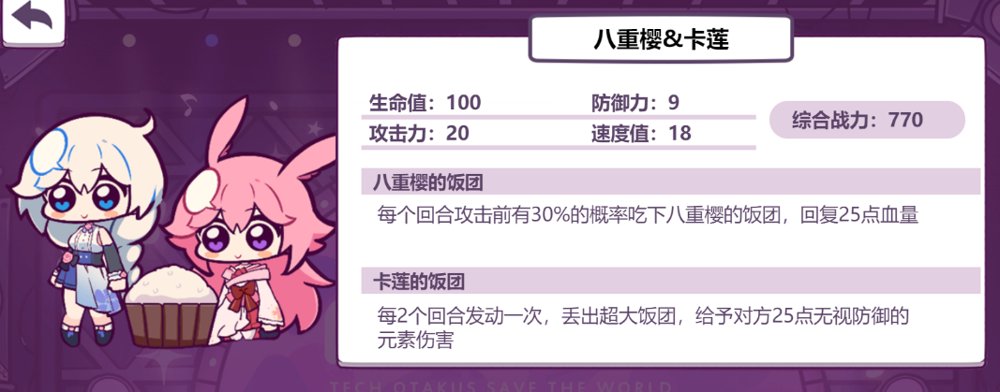

### 渡鸦

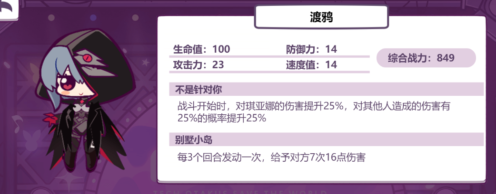

### 德丽莎

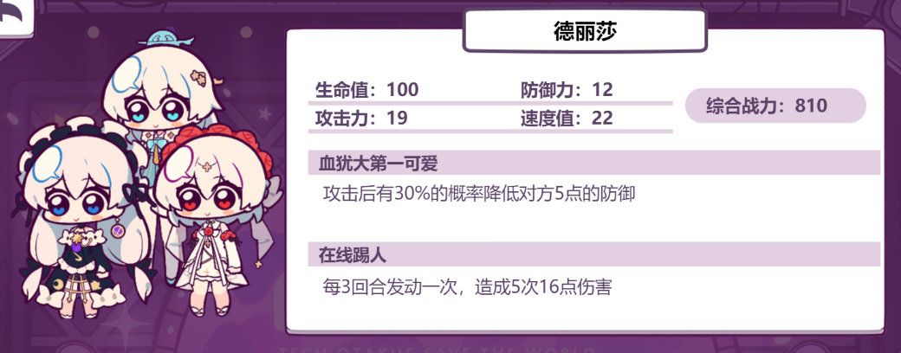

### 罗莎莉娅 & 莉莉娅

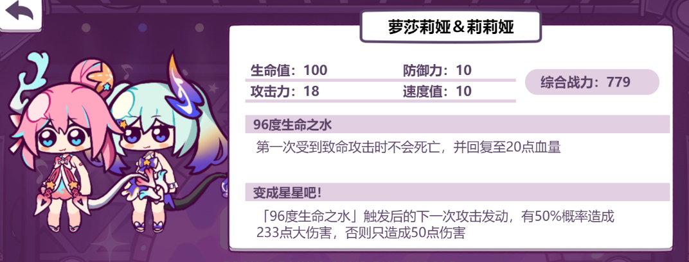

### 希儿

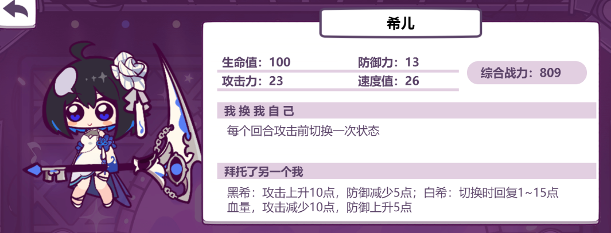

### 幽兰黛尔 & 史丹

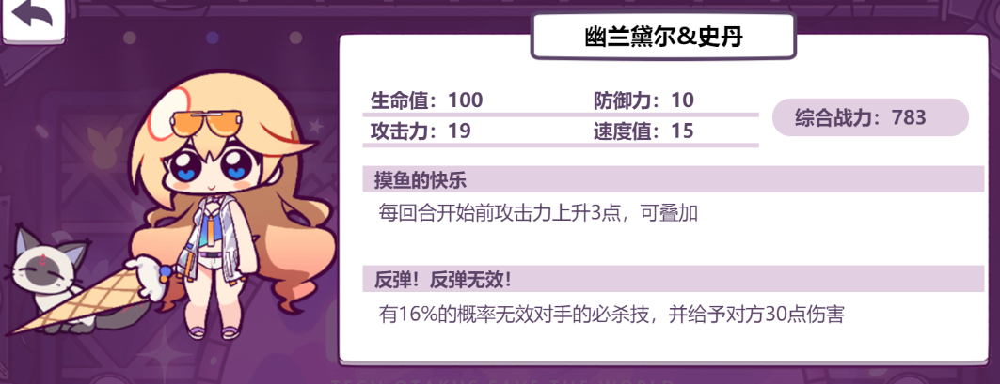

### 符华

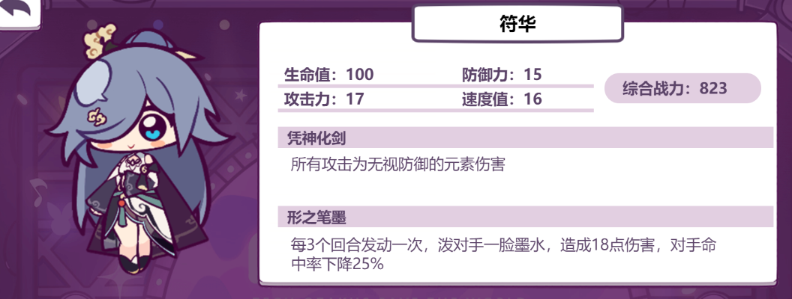

